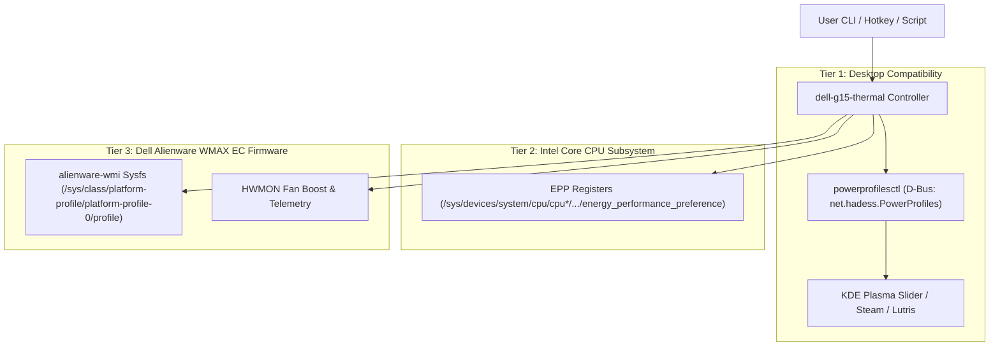

# Dell G15 5530 Thermal Controller & Power Profile Bridge for Linux

[](LICENSE)
[](https://kernel.org)
[](https://www.dell.com)

A complete, production-grade thermal control and power management solution for the **Dell G15 5530** (Intel Core 13th Gen Raptor Lake HX + NVIDIA RTX 3050/4050/4060 Laptop GPU) under Linux.

This project bridges Alienware Command Center (AWCC) ACPI WMAX hardware thermal profiles with Linux `power-profiles-daemon`, **preserving 100% compatibility with desktop sliders (KDE Plasma, GNOME) and third-party tools (Steam GameScope, Lutris, GameMode)** while unlocking all 4 native AWCC thermal modes, real-time fan RPM monitoring, fan boost offsets, and a dedicated Game Shift (G-Mode) toggle.

---

## 📑 Table of Contents
1. [The Problem ("prob")](#1-the-problem-prob)
   - [The Reboot Jet-Fan Scream (5500 RPM on Startup)](#11-the-reboot-jet-fan-scream)
   - [The Missing 4th Thermal Mode & Profile Collapse](#12-the-missing-4th-thermal-mode--profile-collapse)
   - [The FreeDesktop D-Bus Barrier](#13-the-freedesktop-d-bus-barrier)
2. [The Solution ("sol")](#2-the-solution-sol)
   - [AWCC Architecture Reverse-Engineered](#21-awcc-architecture-reverse-engineered)
   - [Native Linux Kernel Sysfs Integration](#22-native-linux-kernel-sysfs-integration)
   - [Multi-Tier Synchronization Bridge](#23-multi-tier-synchronization-bridge)
   - [Disentangling True Performance from Game Shift](#24-disentangling-true-performance-from-game-shift)
3. [Everything That Needs To Be Done ("todo")](#3-everything-that-needs-to-be-done)
   - [Quick Install](#31-quick-install)
   - [CLI Commands & Telemetry](#32-cli-commands--telemetry)
   - [Desktop Environment Setup (KDE / GNOME Hotkeys)](#33-desktop-environment-setup)
   - [Game Launcher Integration (Steam / Lutris / GameMode)](#34-game-launcher-integration)
4. [Documentation Index](#4-documentation-index)
5. [License](#5-license)

---

## 1. The Problem ("prob")

### 1.1 The Reboot Jet-Fan Scream
When rebooting or starting up, the Dell G15 5530 frequently triggers **Game Shift (G-Mode)** immediately, spinning both CPU and GPU fans to 100% duty cycle (~5500 RPM) while sitting idle on the desktop.

#### Why This Happens:
1. `power-profiles-daemon` (PPD) saves the last selected profile across reboots in `/var/lib/power-profiles-daemon/state.ini`.
2. If `performance` was saved, PPD automatically reapplies `performance` upon boot by writing `"performance"` to `/sys/firmware/acpi/platform_profile`.
3. In the Linux kernel driver `drivers/platform/x86/dell/alienware-wmi-wmax.c`, Dell G-Series laptops match the `g_series_quirks` table (`.gmode = true`).
4. This quirk hardcodes `PLATFORM_PROFILE_PERFORMANCE` to call ACPI method `0x25, 0x01` (Game Shift ON), forcing the Embedded Controller (EC) into 100% fan overdrive.

### 1.2 The Missing 4th Thermal Mode & Profile Collapse
Under Windows AWCC, Dell G15 laptops provide **4 distinct slider stops**:
1. **Battery Saver** (`0xa5`)
2. **Quiet** (`0xa3`)
3. **Balanced** (`0xa0`)
4. **Performance** (`0xa1` — Full CPU/GPU power boost with **dynamic smart acoustic curves**)
5. *Dedicated Game Shift Toggle* (`0xab` — 100% Fan Overdrive)

Under Linux, modern kernels register two conflicting platform-profile drivers:
- `platform-profile-0` (`alienware-wmi`): Supports all 5 modes (`low-power`, `quiet`, `balanced`, `balanced-performance`, `performance`).
- `platform-profile-1` (`dell-pc`): Only supports `{cool, quiet, balanced, performance}`.

Because `/sys/firmware/acpi/platform_profile_choices` is the **intersection** of all active drivers:
$$\text{Choices} = \{\text{alienware-wmi}\} \cap \{\text{dell-pc}\} = \{\text{quiet}, \text{balanced}, \text{performance}\}$$

The aggregate sysfs interface collapses to 3 profiles. Both `low-power` (Battery Saver) and `balanced-performance` (True Performance without fan scream) are completely hidden from user space!

### 1.3 The FreeDesktop D-Bus Barrier
The FreeDesktop standard D-Bus API for power management (`net.hadess.PowerProfiles`) strictly defines only three profiles: `power-saver`, `balanced`, and `performance`.

Desktop widgets (the KDE Plasma battery slider, GNOME power settings) and game launchers (Steam GameScope, Lutris, Feral GameMode) are hardcoded to communicate with this 3-state D-Bus interface. Replacing or removing `power-profiles-daemon` breaks desktop integration.

---

## 2. The Solution ("sol")

### 2.1 AWCC Architecture Reverse-Engineered
From reverse-engineering `/home/p/Downloads/AWCC-main`, the Dell G15 5530 hardware definition in `database.json` is:
```json
"Dell G15 5530": {
    "featureSet": "1111111",
    "thermalModes": "11001111",
    "lightingModes": "111111"
}
```

The 8-bit thermal bitmask (`11001111`) maps directly to:
- **Bit 3**: Battery Saver (`0xa5`)
- **Bit 0**: Quiet (`0xa3`)
- **Bit 1**: Balanced (`0xa0`)
- **Bit 2**: Performance (`0xa1` — True boost, smart dynamic fans)
- **Bit 6**: Game Shift / G-Mode (`0xab` — 100% fan override)

### 2.2 Native Linux Kernel Sysfs Integration
On Linux 6.12+ (and Zen kernel 7.x), the `alienware-wmi` driver exposes these exact ACPI calls directly in sysfs:
- **Thermal Profiles**: `/sys/class/platform-profile/platform-profile-0/profile`
- **CPU Fan Boost (0-100%)**: `/sys/class/platform-profile/platform-profile-0/device/hwmon/hwmon4/fan1_boost`
- **GPU Fan Boost (0-100%)**: `/sys/class/platform-profile/platform-profile-0/device/hwmon/hwmon4/fan2_boost`
- **Real-Time Fan Speeds**: `fan1_input` (CPU RPM) & `fan2_input` (GPU RPM)
- **Die Temperatures**: `temp1_input` (CPU °C) & `temp2_input` (GPU °C)

### 2.3 Multi-Tier Synchronization Bridge
This repository provides a unified orchestration bridge ([`scripts/dell-g15-thermal`](scripts/dell-g15-thermal)) that coordinates all layers simultaneously:



| Mode | Desktop Slider (`powerprofilesctl`) | CPU EPP Register | Dell WMAX ACPI Profile | Acoustic Behavior |
| :--- | :--- | :--- | :--- | :--- |
| **`battery`** | `power-saver` | `power` | `low-power` (`0xa5`) | Passive / throttled |
| **`quiet`** | `power-saver` | `power` | `quiet` (`0xa3`) | Whisper (~800–1200 RPM) |
| **`balanced`** | `balanced` | `balance_performance` | `balanced` (`0xa0`) | Normal adaptive curve |
| **`performance`**| `performance` | `performance` | `balanced-performance` (`0xa1`)| **Unlocked Boost, Dynamic Smart Fans (NO SCREAM)** |
| **`gmode`** | `performance` | `performance` | `performance` (`0xab`) | **Game Shift 100% Fan Override (~5500 RPM)** |

### 2.4 Disentangling True Performance from Game Shift
- **True Performance (`0xa1` / `balanced-performance`)**: Lifts CPU PL1/PL2 limits to maximum and boosts RTX 3050 GPU TGP to 95W Dynamic Boost while allowing the fans to scale smoothly between 2000 and 3800 RPM according to temperature.
- **Game Shift (`0xab` / `gmode`)**: Dedicated override that locks fans at 100% duty cycle (~5500 RPM) for torture tests or extreme cooling.

---

## 3. Everything That Needs To Be Done

### 3.1 Quick Install
Run the automated installer:
```bash
git clone https://github.com/ullu1221/dell-g15-thermal-control.git
cd dell-g15-thermal-control
sudo ./install.sh
```

The installer configures:
1. `/usr/local/bin/dell-g15-thermal` executable CLI.
2. `/etc/udev/rules.d/99-dell-g15-thermal.rules` for passwordless hardware register access by group `wheel`.
3. `/etc/systemd/system/dell-g15-thermal.service` to guarantee quiet, smooth startup on every boot.
4. Normalizes `/var/lib/power-profiles-daemon/state.ini` to `balanced`.

---

### 3.2 CLI Commands & Telemetry

#### Display Telemetry
```bash
$ dell-g15-thermal status

=================================================================
 DELL G15 5530 NATIVE THERMAL & POWER PROFILE STATUS
=================================================================
powerprofilesctl Profile:  BALANCED (Active in Desktop Slider)
Native AWCC WMAX Profile:  BALANCED (0xa0)
Game Shift / G-Mode:       OFF [Dynamic Fan Curve]
CPU Energy Preference:     balance_performance
-----------------------------------------------------------------
CPU Fan:                   892 RPM (Boost Offset: 0%)
GPU Fan:                   1016 RPM (Boost Offset: 0%)
CPU Temperature:           59 °C
GPU Temperature:           30 °C
=================================================================
```

#### Change Profiles
```bash
# True Performance (unlocked PL1/PL2 & 95W TGP; dynamic smart fans)
dell-g15-thermal mode performance
# Or shortcut:
dell-g15-thermal performance

# Quiet Mode (whisper silent acoustics)
dell-g15-thermal mode quiet

# Balanced Mode
dell-g15-thermal mode balanced
# Or shortcut:
dell-g15-thermal balance

# Battery Saver
dell-g15-thermal mode battery
```

#### Toggle Game Shift (G-Mode)
```bash
# Toggles 100% fan overdrive on and off
dell-g15-thermal gmode
```

#### Inspect or Adjust Fan Boost Offsets
```bash
# View fan telemetry
dell-g15-thermal fan

# Set CPU fan boost to 50% and GPU fan boost to 50%
dell-g15-thermal fan 50 50

# Reset fan boost offsets to 0%
dell-g15-thermal fan 0 0
```

---

### 3.3 Desktop Environment Setup

#### KDE Plasma 6 Custom Shortcuts:
1. Open **System Settings** $\to$ **Keyboard** $\to$ **Shortcuts** $\to$ **Custom Shortcuts**.
2. Add a command shortcut for Game Shift:
   - **Name**: `Toggle Game Shift (G-Mode)`
   - **Command**: `/usr/local/bin/dell-g15-thermal gmode`
   - **Shortcut**: `F9` (or `Fn + F9`)
3. Add a command shortcut for True Performance:
   - **Name**: `Activate Performance Mode`
   - **Command**: `/usr/local/bin/dell-g15-thermal mode performance`
   - **Shortcut**: `Meta + Shift + P`

---

### 3.4 Game Launcher Integration

#### Steam Launch Options
```bash
dell-g15-thermal mode performance && %command% ; dell-g15-thermal mode balanced
```

#### Lutris Game Configuration
- **Pre-launch script**: `/usr/local/bin/dell-g15-thermal mode performance`
- **Post-exit script**: `/usr/local/bin/dell-g15-thermal mode balanced`

#### Feral Interactive GameMode (`/etc/gamemode.ini`)
```ini
[custom]
start=dell-g15-thermal mode performance
end=dell-g15-thermal mode balanced
```

---

## 4. Documentation Index

For exhaustive technical references, see:
- [`docs/PROBLEM_ANALYSIS.md`](docs/PROBLEM_ANALYSIS.md): Technical post-mortem on kernel driver quirks, multi-driver collision, and D-Bus limitations.
- [`docs/AWCC_REVERSE_ENGINEERING.md`](docs/AWCC_REVERSE_ENGINEERING.md): Bytecode reference, WMAX opcodes (`0x14`, `0x15`, `0x25`), bitmasks, and fan registers.
- [`docs/ARCHITECTURE_AND_SOLUTION.md`](docs/ARCHITECTURE_AND_SOLUTION.md): The multi-tier synchronization architecture and profile mapping logic.
- [`docs/DEPLOYMENT_AND_SETUP.md`](docs/DEPLOYMENT_AND_SETUP.md): Step-by-step installation, desktop configuration, and troubleshooting guide.

---

## 5. License

This project is licensed under the [MIT License](LICENSE).
