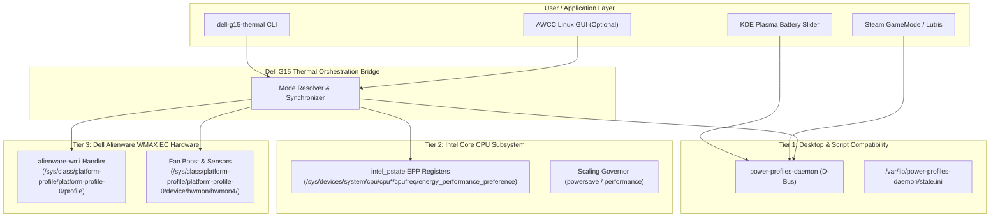

# Architecture & Solution: The Unified Dell G15 Thermal Bridge

## 1. Core Philosophy

The primary objective of this project is to solve the Dell G15 5530 thermal control dilemma **without trade-offs**:
1. **Preserve 100% Compatibility with Standard Linux Tools**:
   `power-profiles-daemon` (PPD) and its D-Bus interface (`net.hadess.PowerProfiles`) must remain completely intact. Desktop sliders (KDE Plasma Powerdevil, GNOME control center) and gaming launchers (Steam GameScope, Lutris, Feral GameMode) must continue functioning without modification.
2. **Unlock All 4 Native AWCC Modes + G-Mode**:
   Users must be able to activate Battery Saver (`0xa5`), Quiet (`0xa3`), Balanced (`0xa0`), Performance (`0xa1`), and Game Shift (`0xab`) on demand.
3. **Eliminate the 100% Fan Roar on Boot**:
   Startup must always be whisper-quiet, with the system initializing in a stable, quiet/balanced state.
4. **Disentangle "Performance" from "Game Shift"**:
   "Performance" must provide full CPU/GPU boost clocks under dynamic, pleasant thermal curves. Game Shift must be an explicit, opt-in override for torture testing or competitive gaming.

---

## 2. Multi-Tier Synchronization Architecture



---

## 3. Profile Mapping Matrix

Every mode transition coordinates all three hardware/software layers simultaneously:

| Desired Mode | Desktop Slider (`powerprofilesctl`) | Intel EPP Register | Dell WMAX ACPI Profile | Embedded Controller (EC) Behavior |
| :--- | :--- | :--- | :--- | :--- |
| **`battery`** | `power-saver` | `power` | `low-power` (`0xa5`) | Aggressive CPU clock capping; fans 0 RPM / passive |
| **`quiet`** | `power-saver` | `power` | `quiet` (`0xa3`) | Low acoustic limit; fans whisper quiet (~800–1200 RPM) |
| **`balanced`** | `balanced` | `balance_performance` | `balanced` (`0xa0`) | Normal factory dynamic curves; adaptive fan ramp |
| **`performance`** | `performance` | `performance` | `balanced-performance` (`0xa1`) | **Unlocked PL1/PL2 & 95W GPU TGP; dynamic smart fans (NO 100% scream)** |
| **`gmode`** | `performance` | `performance` | `performance` (`0xab`) | **Game Shift override: pins CPU & GPU fans to 100% (~5500 RPM)** |

---

## 4. Key Engineering Innovations

### 4.1 True Performance vs Game Shift Disentanglement
Under standard Linux, running `powerprofilesctl set performance` activates the kernel quirk that fires WMAX method `0x25, 0x01` (Game Shift ON). Fans immediately pin at 100% scream level.

The bridge resolves this by writing `balanced-performance` (`0xa1`) directly to `/sys/class/platform-profile/platform-profile-0/profile`. This tells the Dell Embedded Controller to:
- Lift CPU Power Limit 1 (PL1) and Power Limit 2 (PL2) to maximum (up to 115W turbo).
- Unlock NVIDIA Dynamic Boost on the RTX 3050 Laptop GPU to 95W TGP.
- **Maintain the intelligent dynamic fan curve**, where fans scale between 2000 and 3800 RPM strictly based on die temperatures, avoiding the 5500 RPM jet-engine scream.

### 4.2 Game Shift Toggle (`gmode`)
Game Shift is isolated into its own dedicated command:
```bash
dell-g15-thermal gmode
```
- If Game Shift is **OFF**, it writes `performance` to WMAX, triggering the 100% fan duty cycle override and syncing PPD to `performance`.
- If Game Shift is **ACTIVE**, it disengages the override and gracefully reverts to `balanced`, quieting fans immediately.

### 4.3 Boot Safety & Persistence Guarantee
To prevent the system from ever booting with screaming fans:
1. `system/dell-g15-thermal.service` executes during early multi-user startup (`After=power-profiles-daemon.service`).
2. It sets PPD to `balanced` and writes `balanced` (`0xa0`) to the WMAX profile node.
3. This resets `/var/lib/power-profiles-daemon/state.ini`, guaranteeing that cold boots and reboots remain quiet and cool.

### 4.4 Non-Root Hardware Access via Udev
Normally, writing to sysfs requires `sudo` privileges. To allow regular desktop users and game scripts to adjust thermal modes without root prompts:
- `system/99-dell-g15-thermal.rules` grants read-write access to group `wheel` for `/sys/class/platform-profile/platform-profile-0/profile` and `fan*_boost`.
- Desktop hotkeys and user scripts can change profiles seamlessly.
